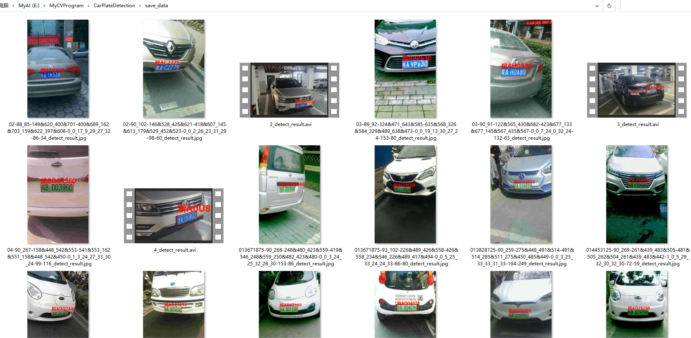
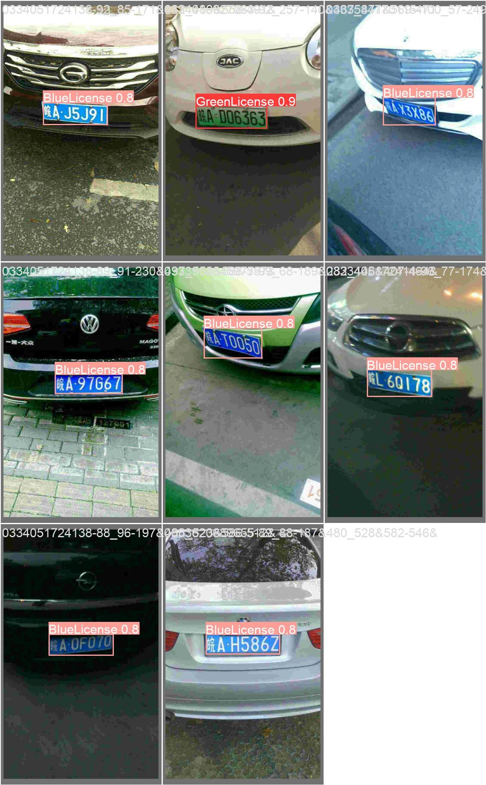
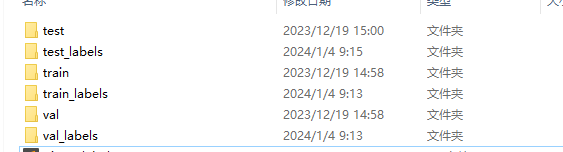
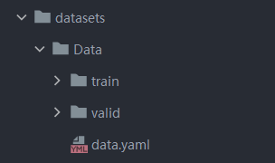
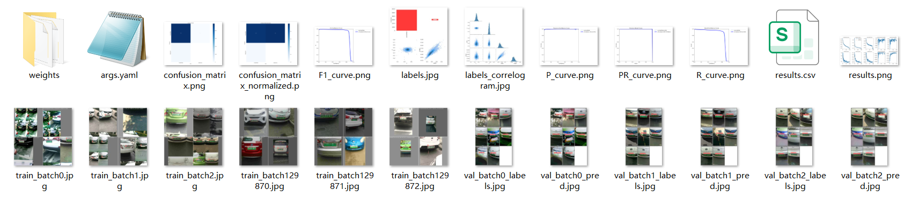
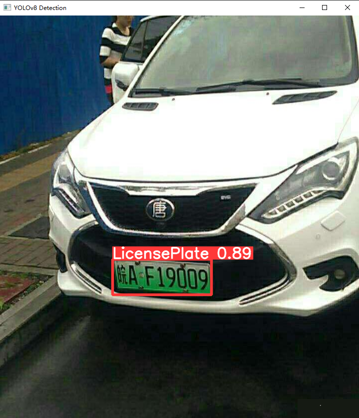
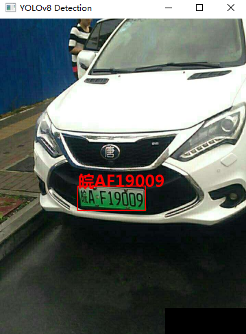

# 基于YOLOv8深度学习的智能车牌检测与识别系统

**仓库不提供main.py和PyQt5相关的界面代码，可自行设计！！！**

## 前言

`智能车牌检测与识别系统` 通过使用最新的YOLOv8与PaddleOCR算法能够迅速、准确地在多种环境下实现实时车牌的检测和识别。这项技术在现代交通管理中具有重要作用，因为它能够自动化和简化许多涉及车辆识别和记录的流程。这样的系统不仅提高了工作效率，还降低了人工错误，提供了便捷且可靠的数据支持，对于加强交通安全、辅助执法以及促进智慧城市构建具有深远意义。

> 智能车牌检测与识别系统的 `应用场景包括` ：
> `交通违章抓拍` ：自动检测违章车辆，并记录车牌号码，用于交通违规的证据收集和处理。
> `停车场管理` ：车牌识别用于自动化的停车场出入管理，实现无人值守收费系统，提升停车场的服务效率。
> `门禁系统` ：在小区或企业区域的门禁系统中应用，仅允许认可的车辆进入，增强安全管理。
> 城市交通监控：监测和分析城市交通流量，以辅助交通规划和拥堵管理。
> `电子收费（ETC` ）：高速公路和其他收费公路上使用车牌识别系统来自动化收费流程，减少交通延误。
> `车辆找寻与监控` ：在大型公共场所辅助找寻特定车辆，或是监控特定车辆的行驶情况。
> `总而言之` ，智能车牌检测与识别系统的实施为交通管理和城市安全带来了显著改进。这一系统不仅提高了相关领域的工作效率和处理速度，也加强了安全监管能力。在未来，随着智慧城市和智能交通系统的持续发展，智能车牌识别技术将会扮演更加关键的角色，为城市的可持续和有序发展贡献重要力量。


## 一、软件核心功能介绍及效果演示

### 软件主要功能

1. 可进行实时 `绿牌与蓝牌这两种车牌的检测与识别` ;
2. 支持 `图片、视频及摄像头` 进行检测，同时 `支持图片的批量检测` ；
3. 界面可实时显示 `目标位置` 、 `识别结果` 、 `置信度` 、 `用时` 等信息;
4. 支持 `图片` 或者 `视频` 的 `检测结果保存` ；
5. **仓库不提供main.py和PyQt5相关的界面代码**



## 二、车牌检测与识别流程

要进行车牌识别，主要分为两步。
`第一步：进行车辆车牌位置的检测` ，本文使用yolov8，通过 `16770` 张图片训练了一个可用于检测绿牌与蓝牌的车牌检测模型来进行车牌检测，检测 `精度为0.994` ；
`第二步：对第一步检测出的车牌进行识别` ，直接使用的是 `PaddleOCR` 对于车牌进行识别。
下面对这些内容进行详细介绍

### 2.1 第一步：车牌检测

本文主要基于yolov8训练了一个车牌检测模型，用于进行车牌位置的检测，主要步骤如下：

#### 2.1.1 yolov8环境配置

> pip install ultralytics -i https://pypi.tuna.tsinghua.edu.cn/simple

yolov8源码地址：https://github.com/ultralytics/ultralytics

**YOLOv8的基本原理** 
YOLOv8是一种前沿的目标检测技术，它基于先前YOLO版本在目标检测任务上的成功，进一步提升了性能和灵活性。主要的创新点包括一个新的骨干网络、一个新的 Ancher-Free 检测头和一个新的损失函数， `可以在从 CPU 到 GPU 的各种硬件平台上运行` 。
**其主要网络结构如下：** 
 

#### 2.1.2数据集准备与处理

本文训练模型使用的数据集为 `CPDD2020绿牌数据集与部分CCPD2019的蓝牌数据集` 。
`数据集下载地址：https://github.com/detectRecog/CCPD` 
CCPD是一个大型的、多样化的、经过仔细标注的中国城市车牌开源数据集。CCPD数据集主要分为CCPD2019数据集和CCPD2020(CCPD-Green)数据集。CCPD2019数据集车牌类型仅有普通车牌(蓝色车牌)，CCPD2020数据集车牌类型仅有新能源车牌(绿色车牌)。
在CCPD数据集中，每张图片仅包含一张车牌，车牌的车牌省份主要为皖。CCPD中的每幅图像都包含大量的标注信息，但是CCPD数据集没有专门的标注文件，每张图像的文件名就是该图像对应的数据标注。
标注最困难的部分是注释四个顶点的位置。为了完成这项任务，数据发布者首先在10k图像上手动标记四个顶点的位置。然后设计了一个基于深度学习的检测模型，在对该网络进行良好训练后，对每幅图像的四个顶点位置进行自动标注。最后，数据发布者雇用了7名兼职工人在两周内纠正这些标注。CCPD提供了超过250k个独特的车牌图像和详细的注释。每张图像的分辨率为720(宽度)× 1160(高)× 3(通道)。实际上，这种分辨率足以保证每张图像中的车牌清晰可辨，但是该数据有些图片标注可能不准。不过总的来说CCPD数据集非常推荐研究车牌识别算法的人员学习使用。

本文使用的数据集一共包含 `16770张车牌数据` 。部分图片如下：




**数据集中图片的命名规则如下：** 
`图片命名：“025-95_113-154&383_386&473-386&473_177&454_154&383_363&402-0_0_22_27_27_33_16-37-15.jpg”` 

解释：

```
1. 025：车牌区域占整个画面的比例；
2. 95_113： 车牌水平和垂直角度, 水平95°, 竖直113°
3. 154&383_386&473：标注框左上、右下坐标，左上(154, 383), 右下(386, 473)
4. 86&473_177&454_154&383_363&402：标注框四个角点坐标，顺序为右下、左下、左上、右上
5. 0_0_22_27_27_33_16：车牌号码映射关系如下: 第一个0为省份 对应省份字典provinces中的’皖’,；第二个0是该车所在地的地市一级代码，对应地市一级代码字典alphabets的’A’；后5位为字母和文字, 查看车牌号ads字典，如22为Y，27为3，33为9，16为S，最终车牌号码为皖AY339S
```

省份：[“皖”, “沪”, “津”, “渝”, “冀”, “晋”, “蒙”, “辽”, “吉”, “黑”, “苏”, “浙”, “京”, “闽”, “赣”,
“鲁”, “豫”, “鄂”, “湘”, “粤”, “桂”, “琼”, “川”, “贵”, “云”, “藏”, “陕”, “甘”, “青”, “宁”,
“新”]

地市：[‘A’, ‘B’, ‘C’, ‘D’, ‘E’, ‘F’, ‘G’, ‘H’, ‘J’, ‘K’, ‘L’, ‘M’, ‘N’, ‘P’, ‘Q’,
‘R’, ‘S’, ‘T’, ‘U’, ‘V’, ‘W’,‘X’, ‘Y’, ‘Z’]

车牌字典：[‘A’, ‘B’, ‘C’, ‘D’, ‘E’, ‘F’, ‘G’, ‘H’, ‘J’, ‘K’, ‘L’, ‘M’, ‘N’, ‘P’,
‘Q’, ‘R’, ‘S’, ‘T’, ‘U’, ‘V’, ‘W’, ‘X’,‘Y’, ‘Z’, ‘0’, ‘1’, ‘2’, ‘3’, ‘4’, ‘5’,
‘6’, ‘7’, ‘8’, ‘9’]

**制作车牌检测数据集：** 
这个数据集的检测和识别标签都在图片名中，可以直接 `通过上述图片的命名规则` ，从图片读取出来，再写入txt文件中即可。代码如下：

```python
import shutil
import cv2
import os

def txt_translate(path, txt_path):
    print(path)
    print(txt_path)
    for filename in os.listdir(path):
        # print(filename)

        list1 = filename.split("-", 3)  # 第一次分割，以减号'-'做分割
        subname = list1[2]
        list2 = filename.split(".", 1)
        subname1 = list2[1]
        if subname1 == 'txt':
            continue
        lt, rb = subname.split("_", 1)  # 第二次分割，以下划线'_'做分割
        lx, ly = lt.split("&", 1)
        rx, ry = rb.split("&", 1)
        width = int(rx) - int(lx)
        height = int(ry) - int(ly)  # bounding box的宽和高
        cx = float(lx) + width / 2
        cy = float(ly) + height / 2  # bounding box中心点

        img = cv2.imread(path + filename)
        if img is None:  # 自动删除失效图片（下载过程有的图片会存在无法读取的情况）
            print(path + filename)
            os.remove(path + filename)
            continue
        width = width / img.shape[1]
        height = height / img.shape[0]
        cx = cx / img.shape[1]
        cy = cy / img.shape[0]

        txtname = filename.split(".", 1)
        txtfile = txt_path + txtname[0] + ".txt"
        # 绿牌是第0类，蓝牌是第1类
        with open(txtfile, "w") as f:
            f.write(str(0) + " " + str(cx) + " " + str(cy) + " " + str(width) + " " + str(height))


if __name__ == '__main__':
    # det图片存储地址
    trainDir = r"G:/datasets/CarPlateData/CCPD2020/ccpd_green/train/"
    validDir = r"G:/datasets/CarPlateData/CCPD2020/ccpd_green/val/"
    testDir = r"G:/datasets/CarPlateData/CCPD2020/ccpd_green/test/"
    # det txt存储地址
    train_txt_path = r"G:/datasets/CarPlateData/CCPD2020/ccpd_green/train_labels/"
    val_txt_path = r"G:/datasets/CarPlateData/CCPD2020/ccpd_green/val_labels/"
    test_txt_path = r"G:/datasets/CarPlateData/CCPD2020/ccpd_green/test_labels/"
    txt_translate(trainDir, train_txt_path)
    txt_translate(validDir, val_txt_path)
    txt_translate(testDir, test_txt_path)
```

 

制作完成后，如上图所示。

#### 2.1.3 目标检测模型训练

图片数据集的存放格式如下，在项目目录中新建 `datasets` 目录，同时将分类的图片分为训练集和验证集放入 `Data` 目录下。
 

同时我们需要新建一个 `data.yaml` 文件，用于存储训练数据的路径及模型需要进行检测的类别。YOLOv8在进行模型训练时，会读取该文件的信息，用于进行模型的训练与验证。 `data.yaml` 的具体内容如下：

```python
train: E:\MyCVProgram\CarPlateDetection\datasets\PlateData\images\train  # train images (relative to 'path') 128 images
val: E:\MyCVProgram\CarPlateDetection\datasets\PlateData\images\val  # val images (relative to 'path') 128 images

# number of classes
nc: 2

# Classes
names: ['GreenLicense','BlueLicense']
```

`注：train与val后面表示需要训练图片的路径，建议直接写自己文件的绝对路径。` 

数据准备完成后，通过调用 `train.py` 文件进行模型训练， `epochs` 参数用于调整训练的轮数， `batch` 参数用于调整训练的批次大小【根据内存大小调整，最小为1】，代码如下：

```python
#coding:utf-8
from ultralytics import YOLO
# 加载预训练模型
model = YOLO("yolov8n.pt")
# Use the model
if __name__ == '__main__':
    # Use the model
    results = model.train(data='datasets/PlateData/data.yaml', epochs=300, batch=4)  # 训练模型
    # 将模型转为onnx格式
    # success = model.export(format='onnx')
```

#### 训练结果评估

在深度学习中，我们通常用损失函数下降的曲线来观察模型训练的情况。YOLOv8在训练时主要包含三个方面的损失：定位损失(box_loss)、分类损失(cls_loss)和动态特征损失（dfl_loss），在训练结束后，可以在 `runs/` 目录下找到训练过程及结果文件，如下所示：



**各损失函数作用说明：** 
`定位损失box_loss` ：预测框与标定框之间的误差（GIoU），越小定位得越准；
`分类损失cls_loss` ：计算锚框与对应的标定分类是否正确，越小分类得越准；
`动态特征损失（dfl_loss）` ：DFLLoss是一种用于回归预测框与目标框之间距离的损失函数。在计算损失时，目标框需要缩放到特征图尺度，即除以相应的stride，并与预测的边界框计算Ciou Loss，同时与预测的anchors中心点到各边的距离计算回归DFLLoss。这个过程是YOLOv8训练流程中的一部分，通过计算DFLLoss可以更准确地调整预测框的位置，提高目标检测的准确性。
**本文训练结果如下：** 


我们通常用 `PR曲线` 来体现精确率和召回率的关系，本文训练结果的PR曲线如下。 `mAP` 表示Precision和Recall作为两轴作图后围成的面积，m表示平均，@后面的数表示判定iou为正负样本的阈值。mAP@.5：表示阈值大于0.5的平均mAP，可以看到本文模型目标检测的 `mAP@0.5` 平均值为 `0.994` ，结果相当不错。


### 4. 检测结果识别

模型训练完成后，我们可以得到一个最佳的训练结果模型 `best.pt` 文件，在 `runs/trian/weights` 目录下。我们可以使用该文件进行后续的推理检测。
图片检测代码如下：

```python
#coding:utf-8
from ultralytics import YOLO
import cv2
# 所需加载的模型目录
path = 'models/best.pt'
# 需要检测的图片地址
img_path = "TestFiles/013671875-93_102-226&489_426&558-426&558_234&546_226&489_417&494-0_0_5_25_33_24_24_33-86-80.jpg"


# 加载预训练模型
# conf	0.25	object confidence threshold for detection
# iou	0.7	intersection over union (IoU) threshold for NMS
model = YOLO(path, task='detect')
# model = YOLO(path, task='detect',conf=0.5)


# 检测图片
results = model(img_path)
res = results[0].plot()
# res = cv2.resize(res,dsize=None,fx=0.3,fy=0.3,interpolation=cv2.INTER_LINEAR)
cv2.imshow("YOLOv8 Detection", res)
cv2.waitKey(0)
```

执行上述代码后，会将执行的结果直接标注在图片上，结果如下：
 

可以发现，该模型能够很好的检测出车牌区域。下面我们需要对检测出的车牌进行识别。

### 2.2 第二步：车牌识别

本文的车牌识别直接使用的是开源的PaddleOCR检测模型。 `地址：https://github.com/PaddlePaddle/PaddleOCR` 

#### 2.2.1环境配置

> pip install paddlepaddle <mark>2.5.2 -i https://pypi.tuna.tsinghua.edu.cn/simple
> pip install paddleocr</mark> 2.7.0.3 -i https://pypi.tuna.tsinghua.edu.cn/simple
> pip install shapely -i https://pypi.tuna.tsinghua.edu.cn/simple

#### 2.2.2 模型使用demo

 

```python
from paddleocr import PaddleOCR, draw_ocr
# Paddleocr目前支持的多语言语种可以通过修改lang参数进行切换
# 例如`ch`, `en`, `fr`, `german`, `korean`, `japan`
cls_model_dir='paddleModels/whl/cls/ch_ppocr_mobile_v2.0_cls_infer'
rec_model_dir='paddleModels/whl/rec/ch/ch_PP-OCRv4_rec_infer'
ocr = PaddleOCR(use_angle_cls=True, lang="ch", det=False,cls_model_dir=cls_model_dir,rec_model_dir=rec_model_dir)  # need to run only once to download and load model into memory
img_path = '22.png'
result = ocr.ocr(img_path, cls=True)

license_name, conf = result[0][0][1]
if '·' in license_name:
    license_name = license_name.replace('·', '')
print(license_name,conf)
```

 

#### 2.2.3加载ocr模型

```python
# 加载ocr模型
cls_model_dir = 'paddleModels/whl/cls/ch_ppocr_mobile_v2.0_cls_infer'
rec_model_dir = 'paddleModels/whl/rec/ch/ch_PP-OCRv4_rec_infer'
ocr = PaddleOCR(use_angle_cls=False, lang="ch", det=False, cls_model_dir=cls_model_dir,rec_model_dir=rec_model_dir)
```

#### 2.2.4 获取车牌位置信息

```python
# 所需加载的模型目录
path = 'models/best.pt'
# 加载预训练模型
# conf	0.25	object confidence threshold for detection
# iou	0.7	int.ersection over union (IoU) threshold for NMS
model = YOLO(path, task='detect')
# model = YOLO(path, task='detect',conf=0.5)
# 检测图片
results = model(img_path)[0]
# 车牌区域信息
location_list = results.boxes.xyxy.tolist()
```

#### 2.2.5抠出上述车牌位置

```python
if len(location_list) >= 1:
    location_list = [list(map(int, e)) for e in location_list]
    # 截取每个车牌区域的照片
    license_imgs = []
    for each in location_list:
        x1, y1, x2, y2 = each
        cropImg = now_img[y1:y2, x1:x2]
        license_imgs.append(cropImg)
        cv2.imshow('111',cropImg)
        cv2.waitKey(0)
```

 

#### 2.2.6使用ocr进行车牌识别

```python
def get_license_result(ocr,image):
    """
    image:输入的车牌截取照片
    输出，车牌号与置信度
    """
    result = ocr.ocr(image, cls=True)[0]
    if result:
        license_name, conf = result[0][1]
        if '·' in license_name:
            license_name = license_name.replace('·', '')
        return license_name, conf
    else:
        return None, None
# 车牌识别结果
lisence_res = []
conf_list = []
for each in license_imgs:
    license_num, conf = get_license_result(ocr, each)
    if license_num:
        lisence_res.append(license_num)
        conf_list.append(conf)
    else:
        lisence_res.append('无法识别')
        conf_list.append(0)
```

#### 2.2.7将识别结果显示在图片上

```python
    for text, box in zip(lisence_res, location_list):
        now_img = tools.drawRectBox(now_img, box, text, fontC)
```

#### 2.2.8完整代码

```python
#coding:utf-8
from ultralytics import YOLO
import cv2
import detect_tools as tools
from PIL import ImageFont
from paddleocr import PaddleOCR


def get_license_result(ocr,image):
    """
    image:输入的车牌截取照片
    输出，车牌号与置信度
    """
    result = ocr.ocr(image, cls=True)[0]
    if result:
        license_name, conf = result[0][1]
        if '·' in license_name:
            license_name = license_name.replace('·', '')
        return license_name, conf
    else:
        return None, None

# 需要检测的图片地址
img_path = "TestFiles/013671875-93_102-226&489_426&558-426&558_234&546_226&489_417&494-0_0_5_25_33_24_24_33-86-80.jpg"
now_img = tools.img_cvread(img_path)

fontC = ImageFont.truetype("Font/platech.ttf", 50, 0)
# 加载ocr模型
cls_model_dir = 'paddleModels/whl/cls/ch_ppocr_mobile_v2.0_cls_infer'
rec_model_dir = 'paddleModels/whl/rec/ch/ch_PP-OCRv4_rec_infer'
ocr = PaddleOCR(use_angle_cls=False, lang="ch", det=False, cls_model_dir=cls_model_dir,rec_model_dir=rec_model_dir)

# 所需加载的模型目录
path = 'models/best.pt'
# 加载预训练模型
# conf	0.25	object confidence threshold for detection
# iou	0.7	int.ersection over union (IoU) threshold for NMS
model = YOLO(path, task='detect')
# model = YOLO(path, task='detect',conf=0.5)
# 检测图片
results = model(img_path)[0]

location_list = results.boxes.xyxy.tolist()
if len(location_list) >= 1:
    location_list = [list(map(int, e)) for e in location_list]
    # 截取每个车牌区域的照片
    license_imgs = []
    for each in location_list:
        x1, y1, x2, y2 = each
        cropImg = now_img[y1:y2, x1:x2]
        license_imgs.append(cropImg)
        cv2.imshow('111',cropImg)
        cv2.waitKey(0)
    # 车牌识别结果
    lisence_res = []
    conf_list = []
    for each in license_imgs:
        license_num, conf = get_license_result(ocr, each)
        if license_num:
            lisence_res.append(license_num)
            conf_list.append(conf)
        else:
            lisence_res.append('无法识别')
            conf_list.append(0)
    for text, box in zip(lisence_res, location_list):
        now_img = tools.drawRectBox(now_img, box, text, fontC)

now_img = cv2.resize(now_img,dsize=None,fx=0.5,fy=0.5,interpolation=cv2.INTER_LINEAR)
cv2.imshow("YOLOv8 Detection", now_img)
cv2.waitKey(0)
```

 


**注**：**仓库不提供main.py和PyQt5相关的界面代码！！！**

### 结束语

> 觉得不错的小伙伴，感谢点赞 !!!
